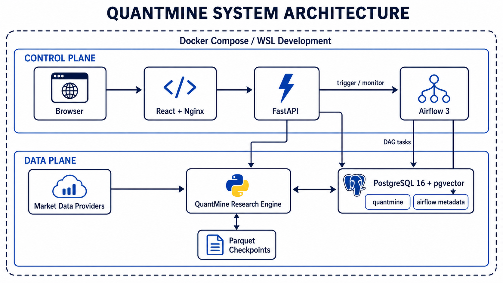
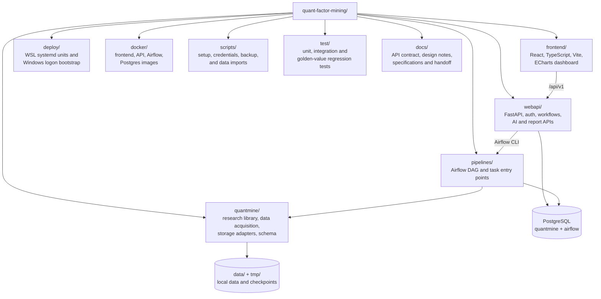
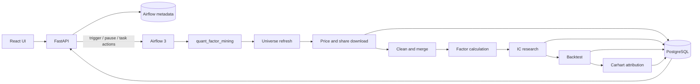

# QUANTMINE

<p align="center">
  
</p>

QUANTMINE is a full-stack US equity factor-research platform. It combines a
React application, FastAPI, Airflow 3, PostgreSQL/pgvector, and an importable
Python research library in one reproducible workflow.

The research layer is built around statistical honesty: point-in-time index
membership, train/test isolation, Newey-West standard errors, multiple-testing
control, expanding-window orthogonalization, turnover-based costs, and Carhart
attribution are first-class parts of the pipeline rather than afterthoughts.

## Features

- **End-to-end factor research** — acquire and clean market data, calculate
  factors, run IC tests, build quantile portfolios, account for turnover costs,
  and perform Carhart attribution in one Airflow DAG.
- **Bias-aware methodology** — point-in-time S&P 500 membership, embargoed
  train/test windows, Newey-West inference, Bonferroni/BH corrections, and
  expanding-window transformations reduce common backtest overstatement.
- **Full-stack workflow control** — inspect DAGs, trigger runs, pause schedules,
  and operate task state from the React application through FastAPI.
- **Durable storage and resumable ingestion** — PostgreSQL/pgvector stores
  research results while disk checkpoints make large market-data downloads
  restartable and measurable.
- **Two deployment paths** — use one-command WSL development for iteration or a
  four-service Docker Compose stack for reproducible local self-hosting.

## Quick Start — Run in 3 Minutes

### Prerequisites

| Tool | Version / requirement |
|---|---|
| Git | 2.40+ recommended |
| Docker | Docker Desktop or Engine with Compose v2 |
| Python | 3.10+ for the Docker secret generator; 3.13 for native development |
| Node.js | 20+ for native frontend development |
| uv | Current release for native Python environments |
| WSL | WSL2 Ubuntu with systemd for the native Windows workflow |
| PostgreSQL | 16 + pgvector for native development; bundled by Docker |

### Docker (recommended)

```bash
# 1. Clone the repository
git clone https://github.com/b00831205-web/QuantMine.git
cd QuantMine

# 2. Generate private local configuration
python scripts/create_docker_env.py

# 3. Build and start all services
docker compose --env-file .env.docker up -d --build

# 4. Confirm container state
docker compose --env-file .env.docker ps
```

Open <http://localhost:8080> and sign in with
`QUANTMINE_ADMIN_USER` / `QUANTMINE_ADMIN_PASSWORD` from `.env.docker`.
Airflow's own UI is available at <http://localhost:8081>.

The generated `.env.docker` contains secrets. It is excluded from Git and from
the Docker build context. Never paste it into issues or commit it.

### WSL development

There are two intentionally separate frontend modes:

| Mode | Frontend URL | Purpose |
|---|---|---|
| WSL logon service (default for this machine) | <http://localhost:8000> | FastAPI serves the built React app; no Vite process is required |
| Manual development | <http://localhost:5173> | Vite with hot reload; it proxies `/api` to port 8000 |

Ports 5175 and 5176 are not used. Vite is configured with a strict port and
will fail clearly if 5173 is occupied instead of silently opening another port.

```bash
# 1. Clone and enter the project inside WSL
git clone https://github.com/b00831205-web/QuantMine.git
cd QuantMine

# Research library, data adapters, tests, database support, and Airflow
uv sync --extra data --extra db --group dev --group pipeline

# Isolated Web API environment
cd webapi && uv sync && cd ..

# Frontend dependencies
cd frontend && npm ci && cd ..

# Create roles/databases, apply schema, initialize Airflow, create an admin
webapi/.venv/bin/python scripts/setup.py

# Start frontend + API + Airflow together
uv run dev
```

Development endpoints:

| Service | URL |
|---|---|
| Frontend | <http://localhost:5173> |
| API docs | <http://localhost:8000/docs> |
| API health | <http://localhost:8000/api/v1/health> |
| Airflow | <http://localhost:8080> |

The initial admin password is printed once and stored in the Git-ignored
`.initial-credentials.json`. Change it after signing in and delete the file.
Run `dev` inside WSL; a Windows shell cannot execute the Linux virtualenv.

## Project Structure

<p align="center">
  
</p>

The overview separates the control plane from the data plane: the browser calls
the React application and FastAPI, FastAPI controls Airflow, and DAG tasks run
the research engine against external market data, resumable Parquet checkpoints,
and PostgreSQL/pgvector.

The repository map below remains Mermaid source so the directory-level view can
evolve alongside the codebase without regenerating the architecture artwork.



### Runtime data flow



## Tech Stack

| Layer | Technology |
|---|---|
| Frontend | React 18, TypeScript, Vite, React Router, ECharts, Vitest |
| API | FastAPI, Pydantic, SQLAlchemy, psycopg2, bcrypt, WeasyPrint |
| Workflow | Apache Airflow 3, BashOperator, LocalExecutor |
| Research | Python 3.13, pandas, NumPy, SciPy, statsmodels, PyArrow |
| Data | yfinance, pandas-datareader, curl-cffi, Beautiful Soup |
| Storage | PostgreSQL 16, pgvector, Parquet checkpoints |
| Delivery | Docker Compose, Nginx, WSL2, systemd user services |

## Current Verified Baseline

The latest clean-database end-to-end run covered schema creation, default-admin
login, all three development services, UI-to-Airflow triggering, pipeline
execution, database consistency, Linux market-data ingestion, and a cache rerun.

| Check | Result |
|---|---|
| One-command WSL development stack | Frontend 5173, API 8000, Airflow 8080 reachable |
| Cross-service orchestration | UI triggered `quant_factor_mining`; all 8 tasks succeeded |
| Database contract | 20 tables, 179 columns, key fields and views consistent |
| Market data | Approximately 1.65M daily rows; no duplicate keys |
| Price checkpoint rerun | 27/27 batches hit cache |
| WSL service startup | target and four user services enabled and healthy |
| Tests | core 165 passed; API 50 passed; frontend 49 passed |

## Pipeline

The Airflow DAG executes:

```text
universe refresh
  -> price/share download
  -> clean and merge
  -> factor calculation
  -> IC calculation
      -> save market bars
      -> quantile backtest
          -> Carhart attribution
```

Manual and scheduled runs share the same task commands. Airflow 3 manual runs
derive the pipeline date from `dag_run.run_after`, which is available even when
the legacy `ds` template is absent.

Example individual tasks:

```bash
.venv/bin/python pipelines/task_0_universe.py --date 2026-08-11 --batch manual
.venv/bin/python pipelines/task_1.py --date 2026-08-11 --batch manual
.venv/bin/python pipelines/task_2.py --date 2026-08-11 --batch manual
```

Research configuration starts from `config.example.yaml`; see
[Research configuration](#research-configuration) for the sections it documents
and how to create a local override.

## Data and Rate-Limit Behavior

- Market data, Parquet files, database files, logs, and checkpoints are not
  distributed with the repository.
- Price batches are checkpointed under `tmp/checkpoint`; an identical rerun
  loads successful batches from disk.
- Historical share-count requests have their own retry budget because the Yahoo
  share endpoint is substantially more rate-limit-prone than price downloads.
- Repeated share failures trip a fast circuit breaker instead of blocking the
  entire DAG for tens of minutes.
- The long-term provider design is separate price and point-in-time share
  sources, for example Tiingo/Polygon prices with SEC EDGAR bulk fundamentals.

## Database Model and Security Boundary

`quantmine/storage/schema.sql` is the single source of truth for the business
schema. Fresh native and Docker deployments both apply this file.

Three database roles are used:

- `quantmine_web`: reads research data and writes only application-state tables
  such as auth, AI conversations, attachments, and report history.
- `quantmine_pipeline`: reads and writes research, universe, factor, and market
  data.
- `airflow`: owns the Airflow metadata database.

The point-in-time `index_membership` table stores membership intervals. A fresh
empty database may seed the complete universe; after a baseline exists, the
daily-change guard prevents an implausibly large scrape diff from being applied.

## Configuration

### Environment files

Native setup writes secrets and connection strings to the ignored root `.env`.
Docker uses the separately generated `.env.docker`. The committed
`.env.docker.example` is a variable reference only; `REPLACE_ME` values are
rejected at container startup.

| Variable | Purpose |
|---|---|
| `QUANTMINE_DATABASE_URL` | Web API connection to the business database |
| `QUANTMINE_PIPELINE_DATABASE_URL` | Pipeline writer connection |
| `QUANT_AIRFLOW_PG_DSN` | Web API read connection to Airflow metadata |
| `QUANT_AUTH_SECRET` | Application session signing secret |
| `QUANTMINE_ADMIN_USER` | Initial application administrator |
| `QUANTMINE_ADMIN_PASSWORD` | Initial administrator password |
| `QUANT_AIRFLOW_BIN` | Airflow CLI used by workflow mutation endpoints |
| `QUANT_AIRFLOW_PYTHON` | Python used for task-state operations |
| `QUANT_PROJECT_ROOT` | Project path seen by Airflow tasks |
| `QUANT_PYTHON_BIN` | Python interpreter used by DAG task commands |
| `http_proxy` / `https_proxy` | Optional upstream proxy for WSL market data |

### Research configuration

`config.example.yaml` documents every optional research section:

- `data_acquisition`: checkpoints, retry budget, and wait behavior;
- `momentum` and `forward_return`: factor and holding horizons;
- `newey_west`, `orthogonalize`, and `time_series_stationary_test`:
  statistical controls;
- `ic_research`: variants, processors, selectors, and tests;
- `backtest`: portfolio jobs, costs, and sensitivity settings;
- `carhart_attribution`: HAC lag configuration.

Copy it to the ignored local file before changing defaults:

```bash
cp config.example.yaml config.yaml
```

## Python Library

```bash
pip install quantmine
pip install "quantmine[data,db]"
```

```python
import quantmine as qm

data = qm.MarketData(close=close_df, volume=volume_df)
pool = qm.build_param_pool(data, day=5, halflife=10, period=20)
failed, factors = qm.calculate_all_factors(pool)

forward = qm.forward_return(data.close, periods=[1, 5, 20])
ic = qm.CS_Information_Correlation(factors, forward, output_path="cs_ic.parquet")
report = qm.multiple_testing(qm.newey_west_summary(ic))
```

Extension points include `DataSource`, `ConstituentsSource`, factor registration,
parameter injection, factor-on-factor dependencies, selectors, and configurable
IC/backtest variants.

## WSL Services and Logon Startup

The persistent WSL services use virtual environments under
`~/.local/share/quantmine/venvs`, on Ubuntu's native filesystem. Do not put a
Linux service environment in the repository on `/mnt/c` or `/mnt/e`: Windows
tools and WSL mount recovery can otherwise damage its executables and symlinks.

From Windows PowerShell, the normal install/update command is:

```powershell
powershell -ExecutionPolicy Bypass -File deploy\update-service.ps1
```

It builds the frontend, deploys it behind FastAPI, refreshes the isolated Ubuntu
environments, restarts the services, and verifies <http://localhost:8000>.
For an offline refresh using the existing uv cache, add `-Offline`.
The service environments install locked dependencies only; application code is
loaded directly from the checkout, so updating source never requires rebuilding
the project as a wheel.

The equivalent manual WSL commands are:

```bash
bash deploy/sync-runtime-envs.sh
bash deploy/install-services.sh --dry-run
bash deploy/install-services.sh
```

Installed units:

- `quantmine-api`
- `quantmine-airflow-apiserver`
- `quantmine-airflow-scheduler`
- `quantmine-airflow-dag-processor`
- `quantmine.target`

Windows must still wake WSL after user logon. From PowerShell:

```powershell
powershell -ExecutionPolicy Bypass -File deploy\register-startup-task.ps1 -StartupFolder
```

The startup task explicitly launches the `Ubuntu` distribution; it does not use
the current WSL default (which may be `docker-desktop`). After logon, open
<http://localhost:8000>. Port 5173 is only present while a developer manually
runs the Vite development server. Its wake-up log is stored at
`%LOCALAPPDATA%\QuantMine\wsl-boot.log`, so startup does not depend on the
repository drive being writable.

An elevated PowerShell can run the script without `-StartupFolder` to register a
scheduled task. Both modes run after a user logs in; neither is an unattended
Windows system service. WSL user services remain alive through systemd linger.

```bash
bash deploy/install-services.sh --status
systemctl --user --failed
curl http://localhost:8000/api/v1/health
curl http://localhost:8080/api/v2/monitor/health
```

The project does not install an Airflow Triggerer because all current DAG tasks
use regular `BashOperator`s.

## Development and Testing

```bash
# Core deterministic suite
.venv/bin/python -m pytest test

# Web API
webapi/.venv/bin/python -m pytest webapi/tests

# Frontend
cd frontend
npm test
npm run typecheck
npm run build
```

Frontend linting and formatting are available through ESLint and Prettier:

```bash
cd frontend
npm run lint
npm run format
```

The Python codebase currently relies on tests, type-aware APIs, and
`git diff --check`; no repository-wide Black/Ruff formatter or enforced coverage
threshold is configured yet. Introduce those tools in `pyproject.toml` and lock
them before making formatting or coverage a CI gate.

Tests marked `network` are excluded from the deterministic default suite because
they depend on live Yahoo behavior. Run them explicitly when validating an
upstream integration:

```bash
.venv/bin/python -m pytest -o addopts= -m network test
```

Golden-value tests skip when their licensed/local reference files are absent.
Changes to factor calculation should run the factor and IC golden tests; changes
to registry or dependency resolution should also run the registry and
`calculate_all_factors` tests.

## Release Hygiene

Before committing or publishing:

```bash
git status --short
git diff --check
git check-ignore -v .env.docker .initial-credentials.json airflow/airflow.cfg data tmp
docker compose --env-file .env.docker config --quiet
```

Never commit `.env*` files except explicit templates, generated credentials,
real Airflow configuration, database files, market data, caches, logs, or build
artifacts. `.dockerignore` independently prevents those files from being sent to
the Docker daemon.

## Detailed Documentation

The repository intentionally has four README files:

1. This file — architecture, complete setup, pipeline, operations, and testing.
2. [`frontend/README.md`](frontend/README.md) — frontend development and structure.
3. [`webapi/README.md`](webapi/README.md) — API development and endpoint domains.
4. [`docker/README.md`](docker/README.md) — container-specific operations.

Detailed contracts and design material remain under `docs/` without additional
README entry points.

Key references:

- [OpenAPI contract](docs/api/openapi.yaml)
- [API error map](docs/api/ERROR_MAP.md)
- [Frontend design handoff](docs/frontend/FRONTEND_DESIGN_HANDOFF.md)
- [Frontend implementation checklist](docs/frontend/STAGE_0_CHECKLIST.md)
- [Operational reliability design](docs/superpowers/specs/2026-08-09-operational-reliability-design.md)
- [Operational reliability implementation plan](docs/superpowers/plans/2026-08-09-operational-reliability.md)
- [Docker operations](docker/README.md)
- [Web API internals](webapi/README.md)

## Contributing

Issues and pull requests are welcome. Keep changes focused and include evidence
that the affected layer still works:

1. Create a feature branch from the current default branch.
2. Update code, tests, and the relevant README/API contract together.
3. Run the deterministic Python, Web API, and frontend checks listed above.
4. Do not include market data, generated credentials, `.env` files, caches, or
   build output in the commit.
5. Open a pull request describing behavior, risk, migration impact, and test
   results. Mark live-provider tests separately from deterministic tests.

For statistical changes, explain possible look-ahead, survivorship, multiple
testing, turnover, or data-revision effects rather than reporting only a metric
improvement.

## Known Limitations

- Yahoo historical share coverage is incomplete and remains rate-limit-prone.
- Historical delistings and acquisitions still leave residual survivorship bias.
- The authorization model targets single-user self-hosting; add role-based
  controls before enabling multiple untrusted users.
- Docker uses Airflow standalone and is not a multi-node production cluster.
- The cost model does not yet include market impact or borrow fees.

## License and Acknowledgments

Released under the [MIT License](LICENSE).

QUANTMINE builds on the work of the open-source communities behind
[Apache Airflow](https://airflow.apache.org/),
[FastAPI](https://fastapi.tiangolo.com/),
[React](https://react.dev/),
[PostgreSQL](https://www.postgresql.org/),
[pgvector](https://github.com/pgvector/pgvector),
[pandas](https://pandas.pydata.org/),
[statsmodels](https://www.statsmodels.org/), and
[yfinance](https://github.com/ranaroussi/yfinance). Market and fundamental data
remain subject to their original providers' terms and must not be redistributed
through this repository.
